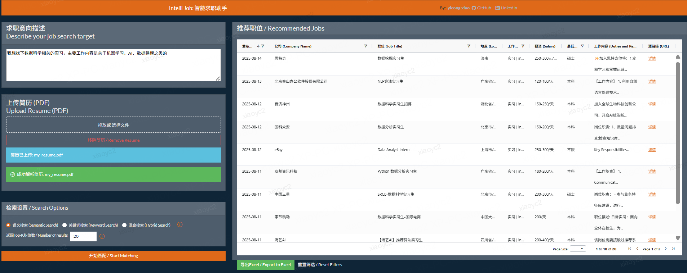

# IntelliJob

IntelliJob is an intelligent job posting recommender system powered by AI. You can input your job seeking target in plain language and/or upload your resume file, and IntelliJob will analyze your input and recommend latest job postings that serve your need.




## Features

- **Resume Parsing:** Extracts structured information from user-uploaded resumes using LLMs.
- **Job Crawling:** Scrapes job postings from platforms like 智联招聘 and 实习僧.
- **Job Matching:** Matches user profiles and preferences with relevant job postings.
- **Interactive Analysis:** Supports natural language queries for job intention analysis.

## Tech Stack

- **Python 3.12+**
- **Scrapy** for web crawling
- **BeautifulSoup** for HTML parsing
- **Dash** for web interface (if used)
- **pdfminer** for PDF resume extraction
- **OpenAI/DeepSeek** for LLM-powered analysis
- **SQLAlchemy** for ORM/database
- **Redis** for caching
- **dotenv** for environment management

## Project Structure

```text
intelli_job/
├── .env
├── .gitignore
├── [init_db.py](http://_vscodecontentref_/2)
├── [main.py](http://_vscodecontentref_/3)
├── run_crawler.py
├── scrapy.cfg
├── app/
│   ├── __init__.py
│   ├── config.py
│   ├── core/
│   │   ├── __init__.py
│   │   ├── job_matching_agent.py
│   │   ├── user_analysis_agent.py
│   ├── models/
│   │   ├── __init__.py
│   │   ├── base.py
│   │   ├── constant.py
│   │   ├── job.py
│   │   ├── user.py
│   ├── routes/
│   └── services/
│       └── language_modeling/
│           └── prompts/
│               └── user_analysis.py
└── job_crawler/
    ├── __init__.py
    ├── items.py
    ├── [pipelines.py](http://_vscodecontentref_/11)
    ├── random_user_agent.py
    ├── settings.py
    ├── [utils.py](http://_vscodecontentref_/12)
    └── spiders/
```
