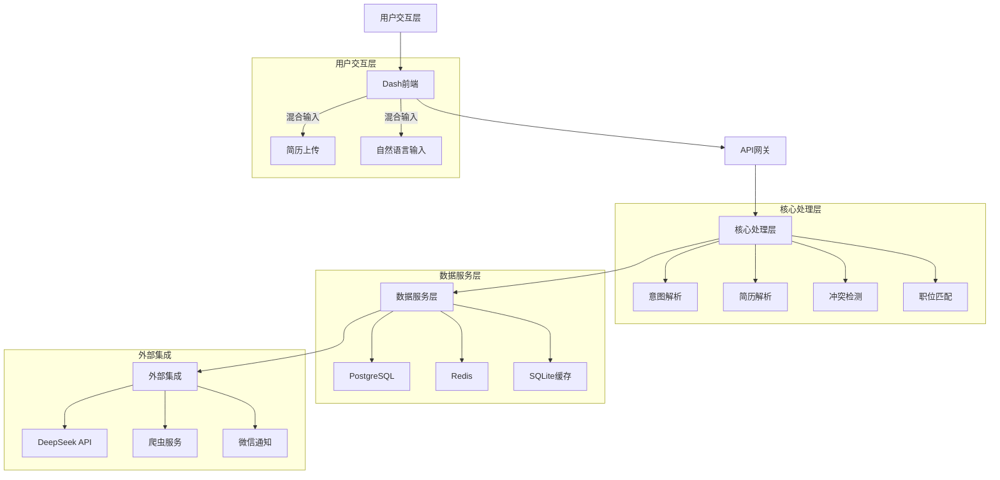
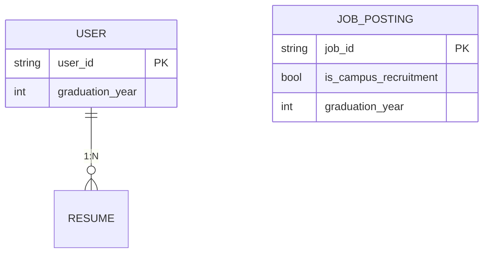
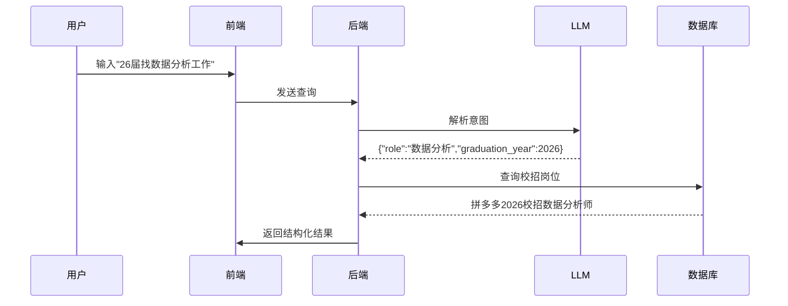

# IntelliJob 技术设计文档

**最后更新**：2023年10月  
**核心目标**：基于AI的个性化求职岗位检索与推荐系统  
**技术栈**：Python + Dash + LLM API + 轻量级爬虫  

---

## 一、产品定位

### 一句话概括
IntelliJob, 一个基于 AI、LLM 实现的个性化求职岗位检索与推荐系统。

### 与传统求职平台的区别
- **主动检索求职信息**：传统平台（如 Linkedin、Indeed、Boss 直聘）需要公司主动登记招聘岗位信息。IntelliJob 通过爬虫和 LLM 技术，主动去公司官网检索开放岗位。
- **更准确的求职意图识别**：传统平台主要依赖关键词检索，用户需直接搜索职位或公司名称。IntelliJob 支持用户输入多样化表达的查询（如“我会用 python，也会数学”），利用 LLM 挖掘用户潜在求职目标并进行检索。

### 用户体验
- **订阅信息流**：用户输入求职意向后，产品会定期将相关开放岗位通过 email/微信发送给订阅用户。
- **职位表格**：以类似 csv 的表格形式呈现，包括公司信息（如“公司名称”、“行业”）及招聘相关信息（如“招聘链接”）。表格会展现在 IntelliJob 首页，也可下载到本地。

### 核心创新点
- 🚀 **主动官网爬虫**：通过Scrapy+Playwright实时抓取企业官网/招聘平台数据  
- 🔍 **语义化搜索**：利用DeepSeek等LLM API理解模糊查询（如"会Python和数学"）  
- 🎯 **应届生专项**：识别`2026届`等毕业年份要求，优先匹配校招岗位  

### 与传统平台对比
| 特性               | IntelliJob                     | 传统平台               |
|--------------------|-------------------------------|-----------------------|
| 数据来源           | 官网+API+爬虫多源聚合         | 仅企业主动发布        |
| 查询方式           | 自然语言输入（支持简历PDF）   | 关键词搜索            |
| 应届生支持         | 自动过滤毕业年份              | 需手动筛选            |

---

## 二、系统架构


---

## 三、核心模块
### 1. 输入处理模块
#### 支持输入类型：
- **自然语言**（如"26届找数据分析工作"）
- **简历PDF**（解析技能/经验）
- **混合输入**（自动冲突检测）

#### 处理流程：
```python
def process_input(text=None, pdf=None):
    if pdf:
        skills = parse_pdf(pdf)  # PyPDF2+LLM解析
    if text:
        intent = parse_text(text)  # Few-shot LLM解析
    return merge_results(skills, intent)
```

### 2. 数据处理模块
#### 数据存储设计：


#### 应届生专项字段：
- `is_campus_recruitment`：是否校招岗位
- `graduation_year`：接受毕业年份
- `internship_to_fulltime`：是否支持实习转正

### 3. 职位匹配模块
#### 匹配策略：
| 场景               | 算法                          | 示例                     |
|--------------------|-----------------------------|--------------------------|
| 精准匹配           | 技能标签完全一致              | 用户会Python → 要求Python |
| 语义匹配           | 向量余弦相似度                | "数据处理" → "数据分析"   |
| 应届生过滤         | 时间范围查询                  | `graduation_year >= 2026` |

---

## 四、用户交互链路
### 1. 典型用例：应届生求职


### 2. 前端渲染示例
```javascript
// Dash Ag-Grid配置
gridOptions = {
    columnDefs: [
        {headerName: "公司", field: "company"},
        {headerName: "匹配度", field: "match_score", cellRenderer: 'progressBar'}
    ],
    rowData: [
        {company: "拼多多", match_score: 0.82}
    ]
}
```

---

## 五、部署方案
### 低成本配置
```yaml
# docker-compose.yml 核心服务
services:
  web:
    image: python:3.9
    command: gunicorn app:server -k uvicorn.workers.UvicornWorker
  redis:
    image: redis
  db:
    image: postgres:13
```

### 资源预估（个人设备）
| 组件       | CPU   | 内存  | 备注                     |
|------------|-------|-------|--------------------------|
| 爬虫       | 2核   | 2GB   | 需代理IP支持             |
| LLM调用    | 1核   | 1GB   | 依赖API（无本地模型）    |
| 数据库     | 1核   | 1GB   | SQLite可替代PostgreSQL   |

---


```
intellijob/
├── .env                    # 环境变量（API密钥等）
├── requirements.txt        # Python依赖
│
├── app/                    # 主应用模块
│   ├── __init__.py
│   ├── main.py             # ？
│   ├── config.py           # ？
│   ├── core/               # 数据模型
│   │   ├── data_handler_agent.py      # 专门管理数据的 agent，对于 app.services.storage.db_controller.DBController 的封装
│   │   ├── user_analysis_agent.py     # 专门对用户的 query 和简历进行分析的 agent
│   │   └── job_fetcher_agent.py       # 专门通过爬虫或api获取招聘岗位信息的 agent
│   │   └── constant.py     
│   ├── static/             # 静态资源
│   ├── crawler/        # 爬虫相关
│   │
│   ├── models/             # 数据模型
│   │   ├── user.py         # 用户模型
│   │   ├── job.py          # 职位模型
│   │   └── base.py         # SQLAlchemy Base
│   │   └── constant.py     
│   │
│   ├── services/           # 核心服务
│   │   ├── llm/            # LLM相关
│   │   │   ├── open_ai_service_provider.py # DeepSeek封装
│   │   │   └── prompts/    # Prompt模板目录
│   │   │
│   │   └── storage/        # 数据存储
│   │       ├── db_controller.py # 对于数据库进行操作的类
│   │       ├── engine.py    # 初始化 SQLAlchemy Engine 作为全局变量
│   │       └── utils.py   
│   │
│   ├── routes/             # ？
│
├── tests/                  # 测试目录
│   ├── unit/               # 单元测试
│   └── integration/        # 集成测试
│
└── scripts/                # 辅助脚本
    ├── init_db.py          # 数据库初始化
    └── deploy.sh           # 部署脚本
```